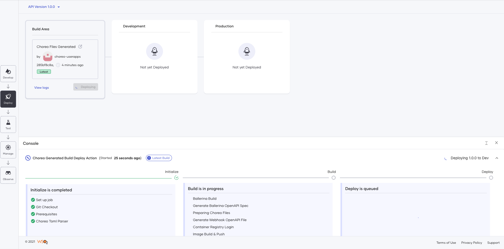
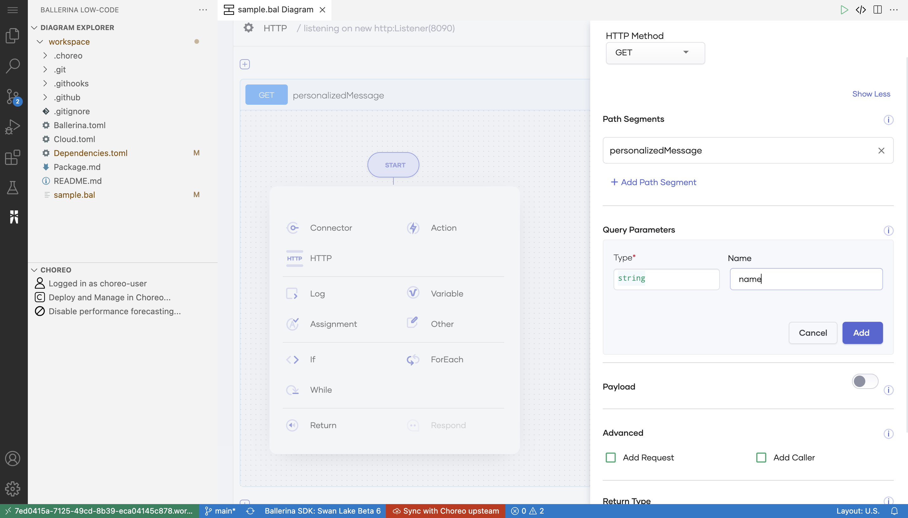
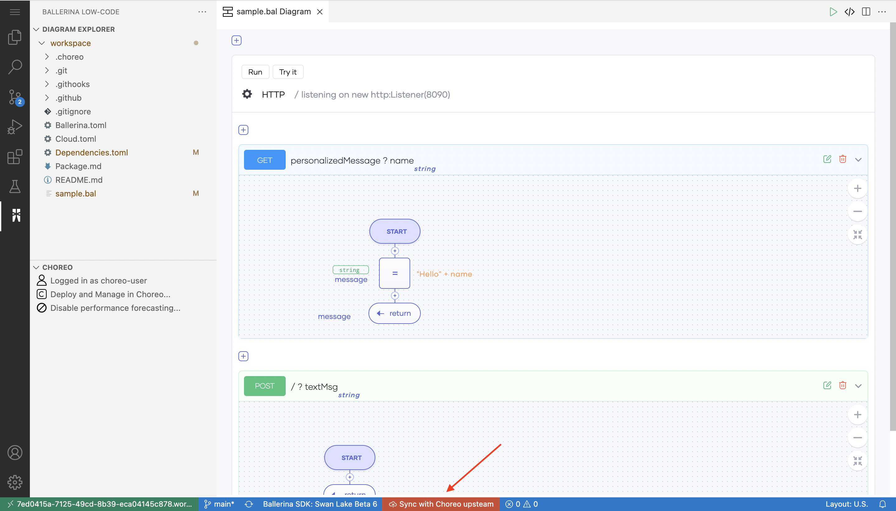
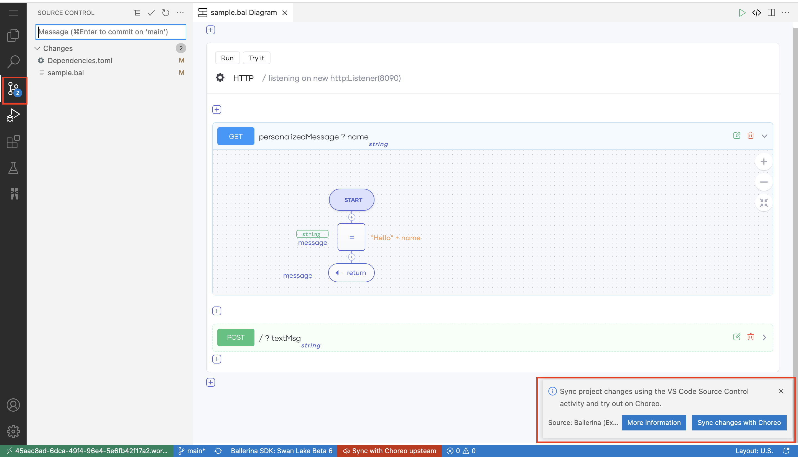
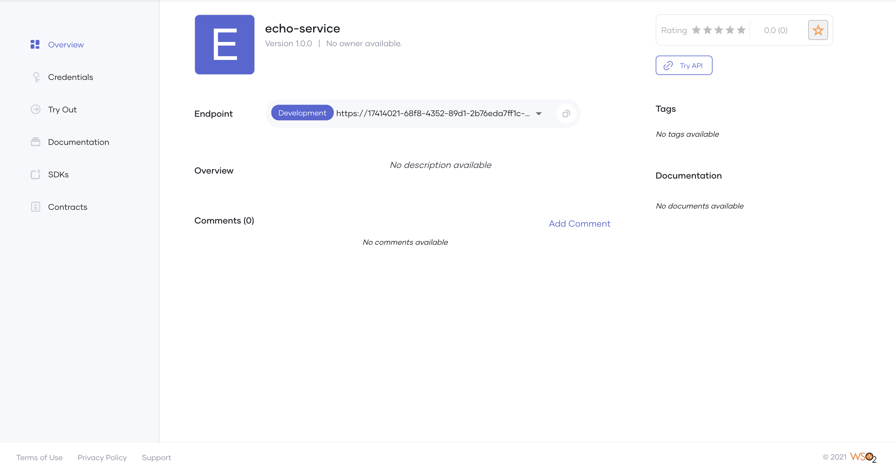
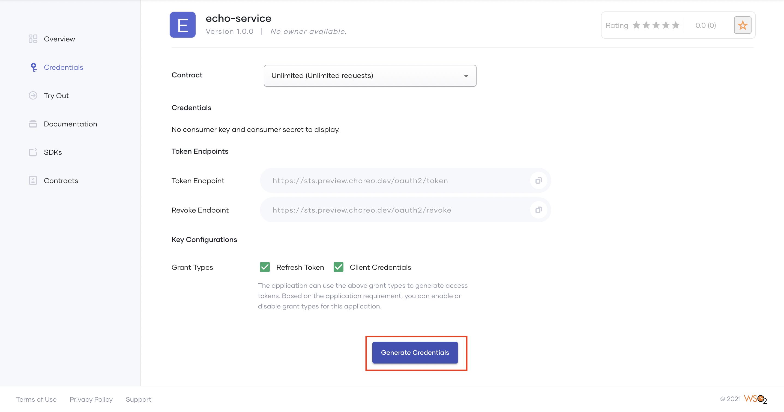
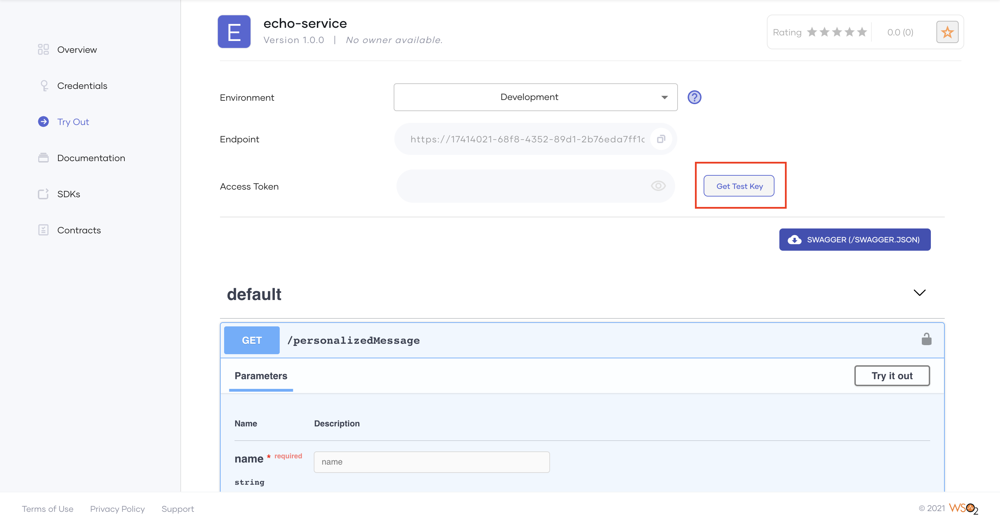
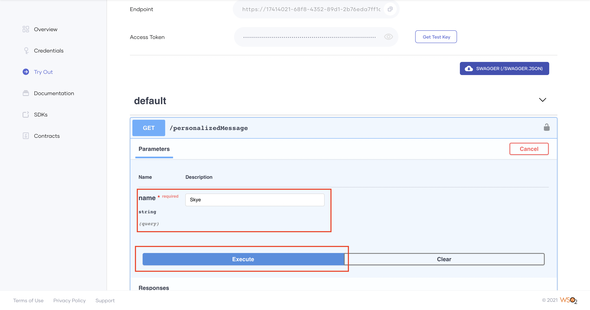

# Quick Start Guide

Choreo is a cloud-native low-code engineering platform that allows you to create APIs, API Proxies, triggers, and scheduled tasks to implement your integration solution. 

This quick start guide walks you through the steps to create, develop, publish, deploy, and invoke a REST API using Choreo. 

## Create your first REST API

### Step 1: Create and deploy a REST API

1. Sign in to the Choreo Console at [https://console.choreo.dev/](https://console.choreo.dev/).

2. On the landing page, scroll down to the **Use a sample and get started** section. 

3. Let's use the **Echo Service** sample. Hover over the sample and click **Get Started**.
 
 You have successfully created an API using a template. You will see the flow diagram of the integration logic implemented for this API. You can learn how to further develop this API in the [Develop the REST API](#develop-the-rest-api) section of this guide. 

 Let's deploy this API and make it invokable.
 
### Step 2: Deploy the REST API 

Let's deploy the API to make it invokable. Choreo maintains 3 environments by default: development and production. We will deploy the API to the development environment. 

1. Click **Deploy** from the left navigation. 

2. Click **Deploy**.

    

You have now successfully deployed your API to the development environment. It is now invokable. Let's test it and verify if it works.

### Step 3: Test the REST API 

1. Click **Test** from the left navigation.

2. Expand the **POST** method with the **/** resource path. 
    

3. Click **Try it out**.

4. Add a meaningful string to the request body. E.g.: `Welcome to Choreo`.
    

5. Click **Execute**.

6. Notice the string you entered in step 4 in the response. 

Congratulations! You have created a REST API using a template, deployed, and tested the API. 

Let's look at how you can add integration logic to the API and further develop this API. Follow the steps in the next section.

## Develop the REST API 

Developing the API involves writing the business logic for the API. APIs often need to integrate with third-party systems to create a comprehensive integration solution. With Choreo, you can create your integration solution easily with a low-code, pro-code editor, or both and publish your API with a faster time-to-market.

In this guide, we will add a new resource to the API and simple business logic:

### Step 1: Develop a simple business logic

1. Click **Develop** from the left navigation. 

2. Then, click **Edit with VS Code Online**.
 
    !!! info
        Opening the VS Code Editor may take a little while if you are a first-time user.
 
    

3. Click **+** on the low-code diagram and select **Resource**. 
  
    
  
    Let's create a new resource with the following values:

 
     | **Field** | **Value** |
     |-----------------|-----------------------|
     | **Method** | `GET` |
     | **Path** | `personalizedMessage` |
     | **Return Type** | `string` |

   

4. Let's add a query parameter to get a name as an input. Click **Advanced** and add a query parameter as follows:

     | **Field** | **Value** |
     |-----------------|-----------------------|
     | **Type** | `string` |
     | **Value** | `name` |

     

 5. Click **Save**.

 6. Now, let's return the personalized message. Expand the created **GET personalizedMessage** resource. You will now see the low-code diagram.

 7. Click on **Variables** on the low-code diagram to add a variable after **Start**. 
    

 8. Configure the variable as follows:

     | **Field** | **Value** |
     |-----------------|-----------------------|
     | **Type** | `string` |
     | **name** | `message` |
     | **string** |`"Hello "+ name`|

     

9. Click **Save**.

10. Let's return the message. Click **+** below the variable we created on the low-code diagram and select **Return**. 
   

    
   
11. Enter `message` as the value in the **Return Expression** text box.
    
12. Click **Save**.

!!!info
    Notice that you can click on the **</>** icon on the top left corner of the editor to open the code-view at any given time. You can choose to develop on the low-code or pro-code or both simultaneously. 
    

### Step 2: Commit Changes to GitHub

Choreo maintains source code in a private GitHub repository. When you create a component in Choreo, it creates it in the private-GitHub repository associated with your account. Therefore, when you change the API Implementation, you need to commit and push your changes. 

1. Click on the **Sync with Choreo upstream** link at the bottom of the editor. 
    

    Alternatively, you can click on the source control button on the left navigation or click on the pop-up that appears at the bottom right corner. 

    

2. Click **Sync my changes with Choreo** in the pop-up that appears. 

     

3. Enter a meaningful commit message and click on the tick sign from the toolbar. This will commit your changes to your private GitHub repository.

     

4. Next, you need to push the changes to GitHub. Click on the **...** on the top toolbar and select **Push** from the list. 

!!! tip
    You need to re-deploy the new changes. Follow steps in section [Deploy Your REST API](#deploy-your-rest-api). 

 Next, let's publish the API 

## Manage your REST API

Choreo provides you with full API management capabilities. You can manage your REST API's lifecycle, apply security, apply rate-limiting policies, configure usage plans, and add documentation.

In this guide, we will publish and invoke the API we created. 

### Step 1: Publish the API
Follow this procedure to publish the API to the API Developer Portal so that external consumers can view and consume the API:

1. Click **Publish** in the left pane.

2. On the **Lifecycle Management** page, click **Publish**.

3. Click **Go to Developer Portal**. 
    {.cInlineImage-full}
 
    You can see the published API in the API Developer Portal:
 
    {.cInlineImage-full}

### Step 2: Invoke the API 
Follow this procedure to invoke the REST API from the API Developer Portal:

1. Click **Credentials** in the left pane.

2. Click **Generate Credentials**. Choreo creates credentials for an internal application and subscribes this API to that internal application.
     {.cInlineImage-full}

2. Click **Generate Access Token**. Copy the generated access token.

     {.cInlineImage-full}

3. Click **Try Out** in the left pane. 

4. Paste the copied access token in the **Access Token** field.
     {.cInlineImage-full}

5. Click the `GET` resource you added to expand it.

6. Click **Try it out** and add a name for the query parameter.
     {.cInlineImage-full} 

7. Click **Execute**. You can see the personalized message response from the API.

Congratulations! You have successfully created a REST API, published it on the API Developer Portal, and finally, invoked the API via the API Developer Portal.
