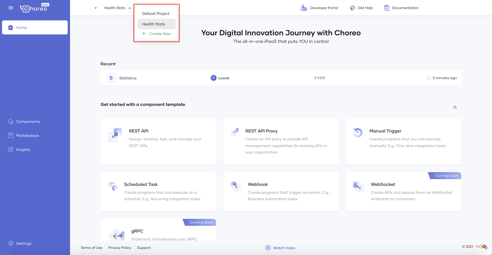
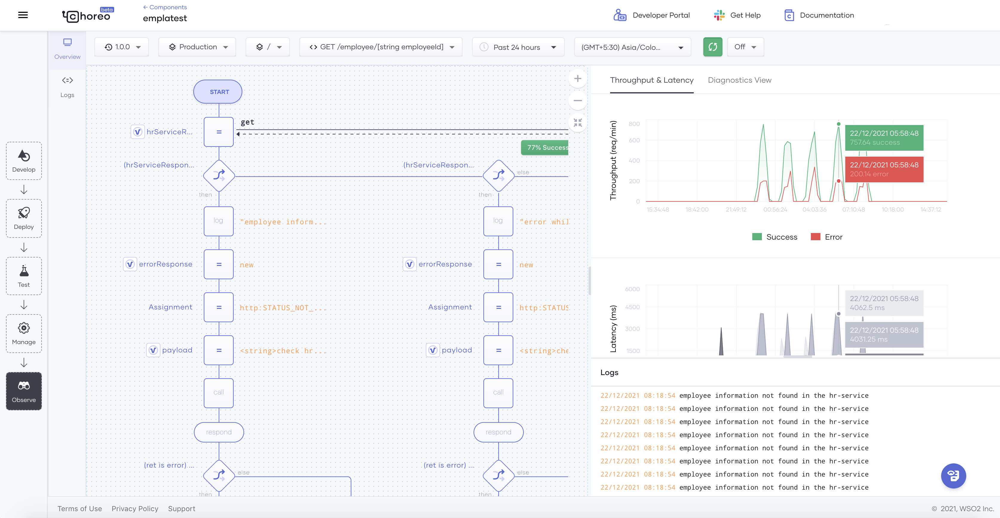
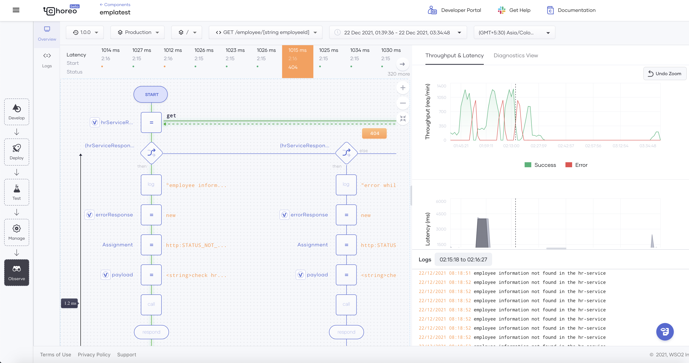
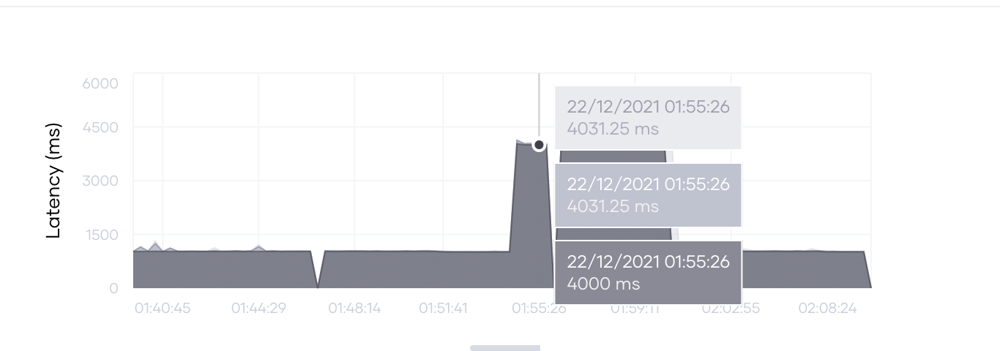
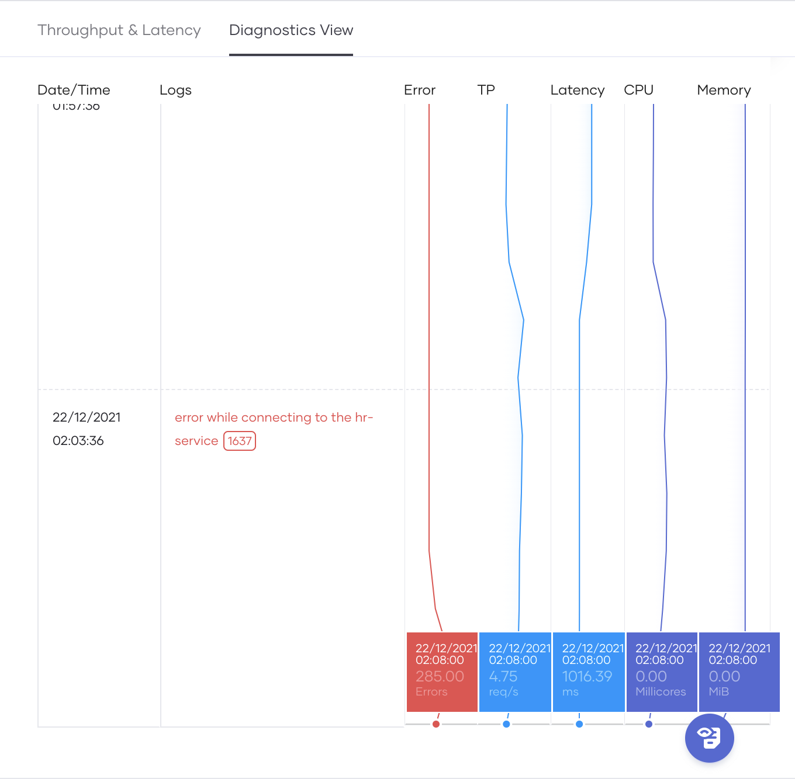

# Root Cause Analysis

Choreo provides insightful observability features to drill down to the request level and confirm the root cause for anomalies you detect. This guide describes how you can detect anomalies and perform root cause analysis on a service deployed in Choreo.

## Access observability data of a component

To visualize the observability data of a component, follow these steps:

1. Access the Choreo Console via https://console.preview.choreo.dev/.

2. On the Home page, select the project with the component that you want to observe.

    {.cInlineImage-full}

3. Click on the component that you need to observe to open it.

4. Open the Observability view for the component by clicking **Observe** in the left panel.

    You can view the following
    
    Low-code diagram
    Throughput graph
    Latency graph
    Logs
    Diagnostic data
    Here you can detect anomalies and perform root cause analysis on the sample service.

## Detect anomalies and perform root cause analysis

To detect anomalies of the component, you must trace its executions from the code statement level to the machine it runs in. You can analyze observability data and logs to troubleshoot and identify the root cause for the anomalies you detect.

### Analyze the throughput graph

The throughput graph depicts the total throughput of the component (which includes both successful and erroneous requests) during a selected time interval. You can analyze the spikes in the throughput graph to identify the root cause for requests that result in an error. The following figure is an example of a throughput graph:

{.cInlineImage-full}

The actions you can perform in a throughput graph are as follows:

- **View the number of successful requests and errors:** To do this, hold the pointer over the area of the graph that shows the required time interval. The throughput graph displays the number of successes over the graph as shown in the figure above (in this example, it displays 757.64 successes and 200.14 errors). The low-code diagram displays the success rate for each API call.

- **View log entries:** If you click the required area on the graph, the log entries applicable for that period are displayed in the Logs pane. In this example, the log displays multiple entries indicating the error `employee information not found in the hr-service`.

- **View data for a custom time range:** You can expand the graph by clicking and dragging the pointer over the period you want to drill down. The default graph displays data for the last 24 hours.

- **View details per request:** Once you view data for a custom time range, each request that was sent during the selected time range is displayed in a pane above the low-code diagram as shown below.

   {.cInlineImage-full}

    This pane displays the latency, the time at which the service received the request, and the status.

    When you click on a specific request, the low-code diagram displays the following:

    - If an error has occurred, the error code is displayed near the relevant API call. In this example, the `404` error code has occurred when the request was processed by an API call.
  
    - The path (control flow) in which the service executed the request is highlighted in green. In this example, the highlighted path indicates that the selected request was processed on the HTTP API call (on the GET request sent).
  
    - The execution time is displayed per `if`, `while`, and `foreach` body. In this example, the execution time taken by the component for the `if` body is 1.2 milliseconds.

### Analyze the latency graph

The latency graph depicts the latency of requests over a selected time interval. You can analyze the spikes in the latency graph to identify the API invocations that result in error status. The actions you can perform are as follows:

- **View details of a latency that has occurred:** To do this, go to the latency graph under the **Throughput & Latency** tab and click a data point where there is a spike. This displays the latency, start time, and status of the corresponding requests just above the low-code diagram as shown in the following figure:

    {.cInlineImage-full}

- **View details for a custom time range:** If you want to drill down to view details at a higher granularity, drag the pointer over a time range to view the graph for the selected period.

- **View details per request:** The latency graph allows you to view details for each request that the service received during a selected custom time range. For details, see [Analyze the throughput graph](#analyze-the-throughput-graph) - **View details per request** bullet point.

### Analyze diagnostic data

The **Diagnostic View** allows you to further drill down the observability data you view in the **Throughput & Latency** tab to identify possible root causes for anomalies of a service. The following figure is an example of how you can view diagnostic data once you click on the **Diagnostics View** tab:

{.cInlineImage-full}

!!! info
    The time range applied to the **Diagnostics View** by default is the same time range for which you viewed the **Throughput & Latency** before clicking on that tab.

If you hold the pointer over a section where you see fluctuations in multiple bins, you can view the related logs as shown in the following figure:

{.cInlineImage-half}

In this example, the logs indicate that the reason for the errors during the selected time interval was that client has been unable to connect to the `hr-service` component. This error has occurred 1637 times.

In the same example, if you further analyze the sample diagnostic data, you can identify the connectivity error as the most common error.
Based on this, you can conclude that the root cause of the anomalous throughput and latencies is the connectivity issue.
