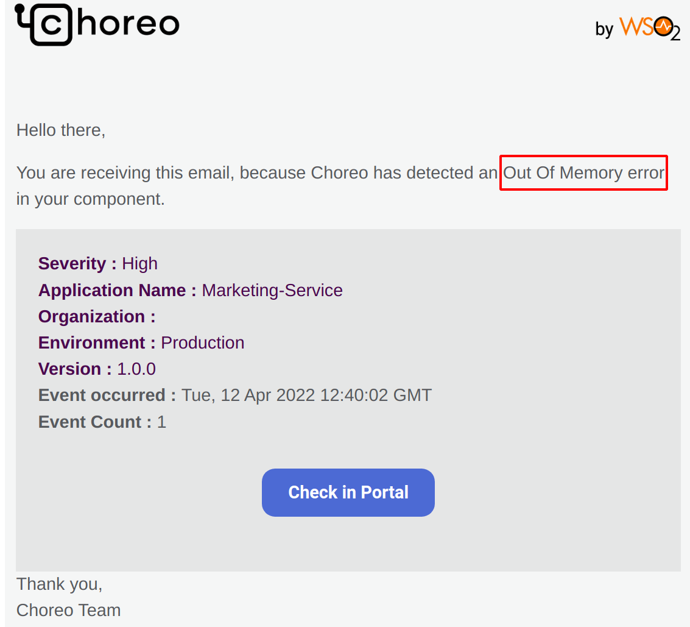
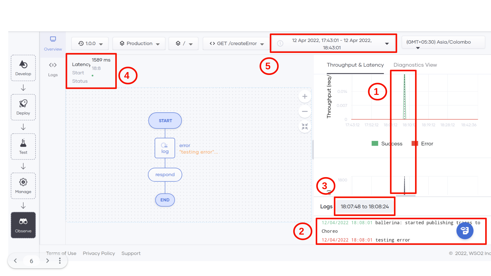

# Alerting

Choreo notifies you when your production applications are in trouble. Whenever a Critical error (Out Of Memory ) occurs or whenever an error is logged by your application, your organization admins will be notified via an email about this incident. This email also contains a link that will take you to the Observability view and also highlights the metrics and logs during the erroneous interval. The alerts are collected every 5 mins (alerting interval) and published to the users.

## Types of Alert email notifications

When an alert occurs for the first time during the alerting interval, it is sent immediately. However, if there are multiple occurrences of the same type of alert for a particular component, then those alerts are suppressed and sent as one email with the **Event Count** to denote how many such alerts occurred during the alerting period. The suppression period used in the Alerting feature is 15 mins.

## Types of Alerts

### Out Of Memory Alert

If the pod running your Choreo component goes out of memory, it will restart automatically. but during that interval the service will be unavailable and all the currently processing requests may become erroneous.
Because of this reason this error is very adverse for your application. Once an Out Of Memory occurs you will get an alert email like the one shown below.

{.cInlineImage-full}

This email contains details about your component and how many times this event occurred within the alert monitoring period.
You can check the logs and the memory usage during that time period by clicking the **Check in Portal** button. This will take you to the Observability view of that particular component. You can also get support from WSO2 by using the **Contact us**  link provided at the bottom of  the alert email.

#### How to troubleshoot Out of Memory error in the Observability view

When you click the Check in Portal button you will be redirected to the Observe page of the component in the Choreo console.

{.cInlineImage-full}

**1** shows the time bin where the Out of Memory error occurred will be highlighted for you and the logs that occurred during that time will be given within the scrollable Logs column. It will also contain the counts of how many such logs occurred.

{.cInlineImage-half}

The link given in the alert email will select a 1hour time range around the time in which the error occurred (i.e. error time +/- 30mins). This is shown in the diagram as **2**. The **Diagnostic View** is divided into 5 similar sized time bins. In this case, the size of each bin will be 12 mins. This is shown by **3**.

{.cInlineImage-half}

When you hover over the graph, you can see the Memory usage and it growing steadily and reaching the maximum value. This will cause the application to restart and it will log the Out of Memory error.

#### Selecting custom time ranges

If the time range that is selected automatically for you is not enough, you can select the time range that you desire and debug further. You can do this by clicking on the Time selection drop down bar shown by 1.

{.cInlineImage-half}

Then you can select the **Custom** option, this will automatically add the time range that is already given by the alert email. You can modify them to see the **Diagnostic View** for that  specific time range.

For more information on how to use the Observability view for Root cause analysis check out the following [page](https://wso2.com/choreo/docs/observability/root-cause-analysis/). 

### Application Error Alert

This alert is triggered when you use the **“log:printError()”** function in your component and it logs an error. We consider that your component must have faced some serious problem and send you an email to notify you about this. The sample email will look like this. The email will provide details about the application and the **Check in Portal** link to view this log along with the request that caused this. You can also get support from WSO2 to troubleshoot this issue by using the **Contact us** link provided in the email.

{.cInlineImage-full}

#### How to troubleshoot Application error in the Observability view

Once you click on the **Check in Portal** link you will be redirected to the observe page of the component in the Choreo console

{.cInlineImage-full}

This will open the **Throughput and Latency** view and automatically select the request that caused this error log. This is shown in **1**, it will show you the throughput and latency of the particular request. The color of the graph will tell you whether that request is successful or an error. You can also see the status of the request; its latency and status code indicated in a green colored circle in **4**. You will also see the error log that triggered the alert email in **2**. The time range used to highlight the relevant error log is indicated in **3**.  But you can scroll up and down and get more logs within the time range specified in **5**. You can also diagnose further by changing the selected time ranges. See the (**Selecting custom time ranges**) section above.