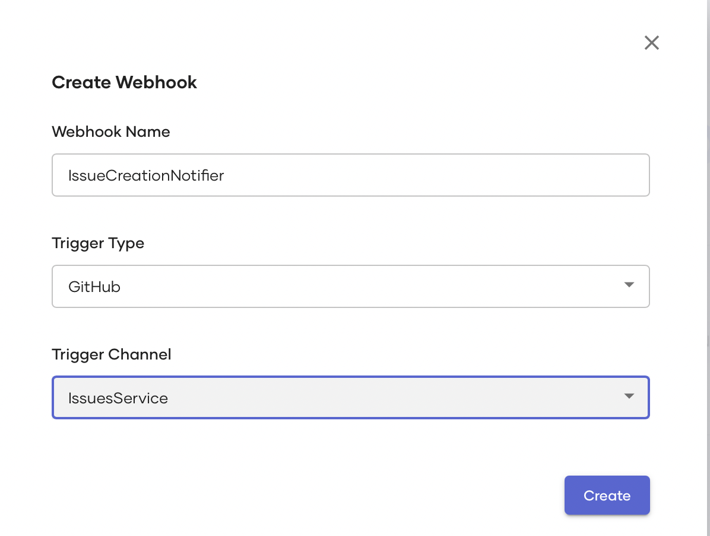
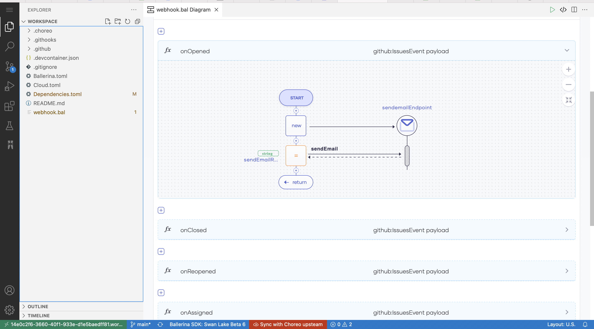
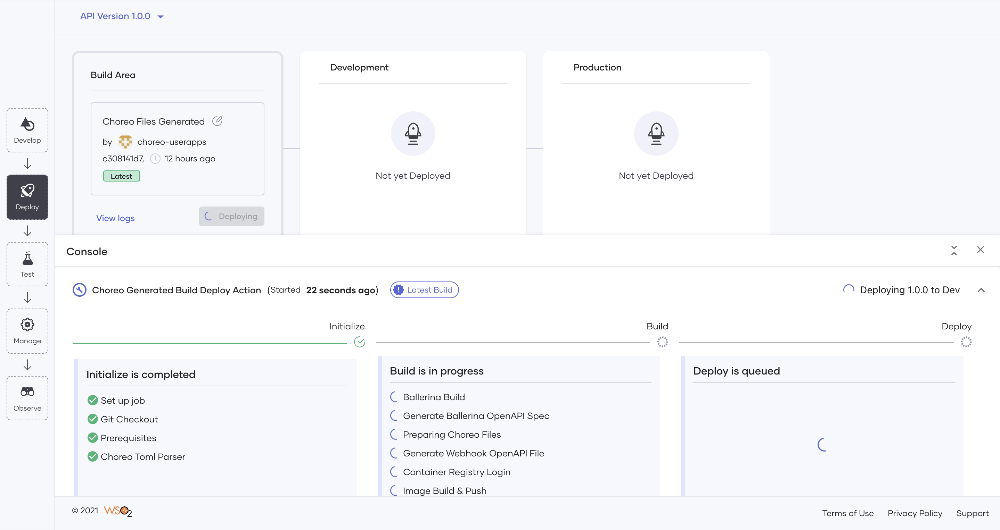
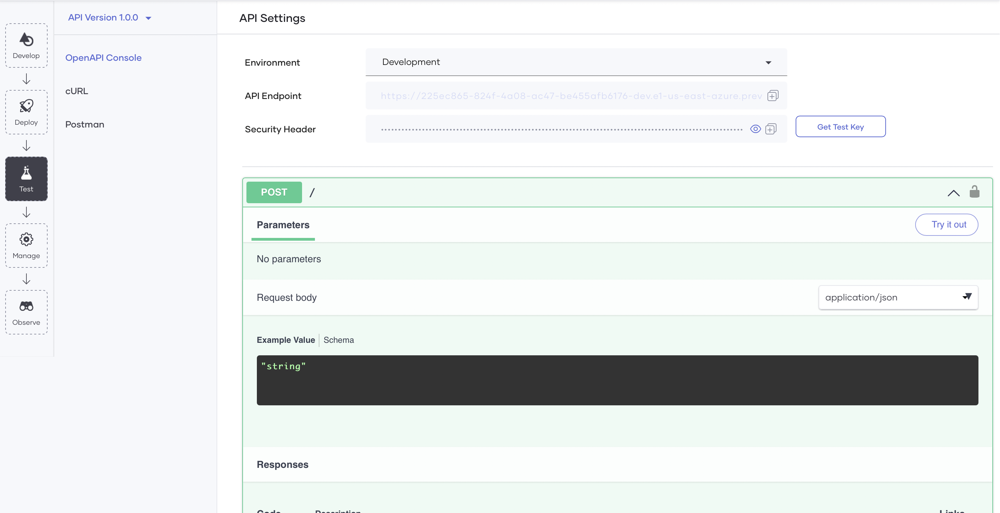
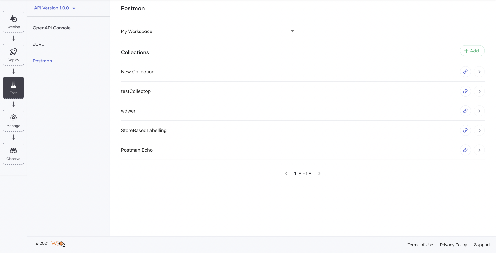
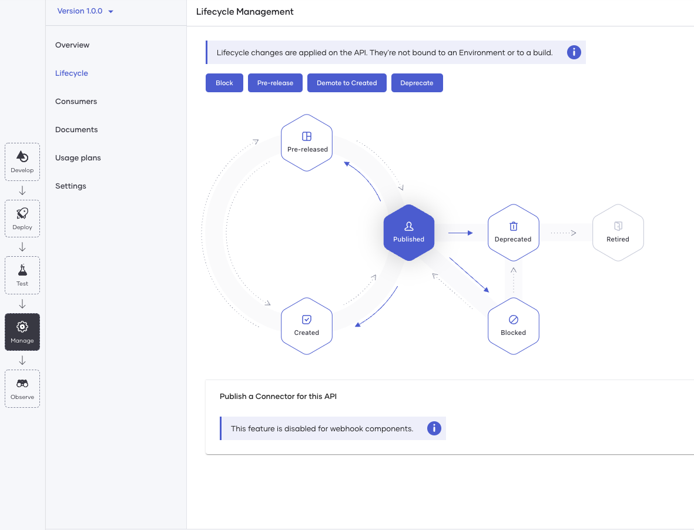
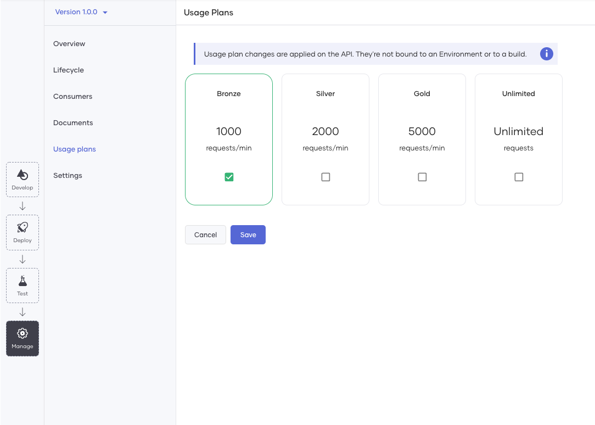
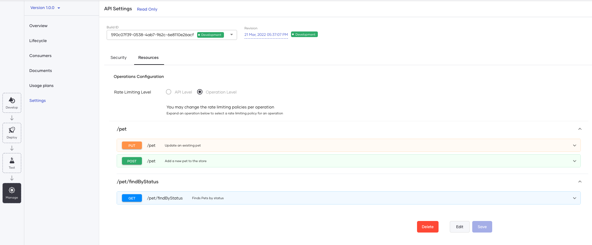
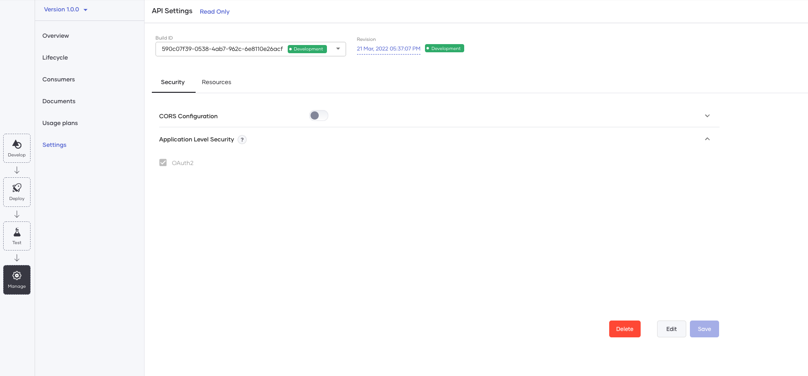

# Triggers
Explore how you can create event-driven integrations with Choreo triggers.

## What is a Trigger?

A trigger is a cause that activates an action. Triggers in Choreo are no different and are user-defined callbacks. 

Triggers are used by developers to implement event-driven integrations. Before event-driven solutions,  to identify an event occurrence, systems had to keep polling other systems periodically.  With event-driven solutions, systems can focus on the main business-flow, and proactively be notified when an event of interest occurs in real-time. The following are some examples of scenarios where you can create webhooks for the mentioned platforms:

- Sending a chat message in a group chat when an event gets added in a slack channel.
- Generating an alert when a new issue gets created in a specific Git repository.
- Sending a notification when an event gets scheduled in a google calendar.

Triggers are a widely used programming element to create event-driven API architectures for real-time solutions.

## Develop a Trigger

Developing a trigger is the process of creating the trigger by identifying the trigger event and implementing the logic to execute the event. You can create and design an event-driven integration using triggers in Choreo easily. 

Choreo’s low-code editor allows developers to easily design (and develop) high-quality triggers for platforms such as GitHub, Slack, and Google Calendar, etc. using the integrated pro-code or low-code editor. Creating a Trigger in Choreo starts by creating a trigger component, and providing a trigger name, selecting the trigger type(e.g. GitHub), and channel(e.g. IssuesServices):

 Once you have created your Trigger, you can start developing the logic for the specific event(E.g. onOpened). Choreo will execute this logic when the Trigger is activated. E.g. send an email when an issue gets created in GitHub.

Additionally, you can define any configurations needed to run the Trigger.

### Low Code Mode

The low-code programming model allows developers to use common programming constructs such as loops, conditions(if/else, variable declarations and assignments, logs, data transformations(visual data mapping), and much more in a graphical editor. It also allows developers to connect to any built-in or custom-developed [connectors](TODO: add a link to connectors).

Choreo allows you to add multiple triggers and channels to your trigger implementation via the low-code editor. It also shows the configurations needed to deploy the Trigger. 

The main advantage of the low-code programming mode is that it increases the developer productivity by multiple folds by eliminating the need to write complex code. As developers use constructs on the low-code editor to implement the integration logic for the Trigger, the IDE automatically writes the corresponding [Ballerina](https://ballerina.io) source code of the Trigger. This speeds up the developer's learning process significantly and thereby boosts overall productivity.

### Pro Code Mode

In addition to the low-code mode, Choreo provides a pro code mode of implementing the Trigger's functionality with the ability to alternate between low-code and pro-code at any time. Choreo's online IDE allows viewing the low-code and pro-code editors side by side:

{.cInlineImage-full}

Choreo gives the developers the flexibility to use the pro-code mode only or use it for implementing certain parts of the API and use the low-code mode for the rest, based on their preference. Choreo treats the source code (generated and handwritten) of the API as the single source of truth and therefore has no limitations or restrictions on which mode developers may choose to implement their Trigger's functionality.

## Deploy a Trigger

 TODO: Written only based on HTTP-based triggers. 

Choreo provides an easy, interactive UI to help you deploy the Trigger in Choreo to the default development environment. On deployment, Choreo prompts to add the configuration values that the developer has configured.

{.cInlineImage-full}

Choreo runs a professional, enterprise-grade CI/CD process to deploy APIs to its runtime(data plane) clusters. Under the hood, Choreo’s data plane runs on a Kubernetes stack and hence benefits from all its features such as auto-scaling, auto-healing, secret management, liveness, readiness checks, etc. When you deploy a trigger, Choreo checks out your latest code, builds it, creates a Docker image, and starts it in a Kubernetes cluster managed by Choreo. At this point, Choreo also registers the Trigger with the relevant event source (e.g., GitHub, Slack, etc.). When the relevant action occurs in the event source, Choreo is notified through the callback. Choreo then activates the Trigger and fires events. Choreo exposes HTTP-based triggers as an API. Therefore, you can test, manage, and observe this API like any other API on Choreo.

Once you deploy the triggers to the development environment, it is active in the developer environment. When you are ready to take the code to the Production, you can promote the deployment and enable the functionality to your consumers. 

Choreo allows you to view the deployment logs through the Deploy view. This helps you troubleshoot and view the status of the builds and deployment. 

### Choreo Environments

Choreo by default provides a development environment and a production environment in two separate Kubernetes clusters. Once you have deployed the Trigger to the development environment and its functionality has been verified, developers can then promote their triggers to the production environment:

{.cInlineImage-full}

Once you have promoted the Trigger to production, Choreo then shows a second URL that developers can use in production applications to invoke the Trigger.

### Test Your Trigger

Testing your Trigger is an integral part of the spec-driven API development approach. Once you deploy your Trigger, it is ready to be tested. Testing your Trigger in Choreo can be done in 3 ways:

- Via the inbuilt OpenAPI Console
- Via cURL
- With a Postman integration

### In-built OpenAPI Console

The in-built OpenAPI console is an interactive UI where you can test your HTTP-based triggers easily. You can test your triggers in the environments you deploy them by selecting the environment. Choreo, by default, uses OAuth2.0 authentication. Therefore the OpenAPI console provides you the option to generate your test keys to test the APIs. Once you meet the pre-requisites, you can test the different resources you defined by specifying any parameters, if needed. 
{.cInlineImage-full}

### cURL

Choreo provides you with a cURL command based on the resource, method, and environment you want to test your Trigger. You need to select the environment, the methods, specify the base path of the resource, and any parameters. Once you provide the information to Choreo, it will generate a cURL command with an API key in place for you to test. 

{.cInlineImage-full}

### Postman

Choreo also allows you to integrate Postman. To integrate Postman, you need to create a postman account, generate an API Key from Postman, and include them in the Choreo UI. Once you integrate Postman successfully, you can import Postman workspaces, or create new workspaces and continue to test it on Choreo.

{.cInlineImage-full}

## Manage Triggers

Choreo exposes HTTP-based triggers as APIs. Therefore, you can leverage the API management capabilities of Choreo to manage these APIs. API Management has automatically turned on for HTTP-based triggers(and other APIs) on Choreo. Converting an unmanaged API to a managed API is a key advantage. Developers can use its capabilities to manage the exposure of APIs to their consumers. Developers can configure the API’s security settings, set rate limits, associate usage plans, provide other documentation, and perform other related functions to govern the API. 

### Lifecycle of the API exposing the Trigger 

Once you implement a trigger, it needs to be built, tested, and eventually put into production as an API. Choreo executes a CI/CD pipeline that manages the API’s Lifecycle. Choreo stores the source code of triggers in a private Github repository for the user account. The CI/CD pipeline in Choreo takes an API through the whole process, starting with code checkout, to compile, build, test, and finally to deployment.

{.cInlineImage-full}

### Add Documentation to the API exposing the Trigger

A well-designed API needs to be well-documented as well. The usability of the API is a deciding factor of its value. Many API developers find documenting an API a tedious task. Choreo makes documentation an easy task for developers by allowing different sources of documentation. Choreo allows you to add documentation to the REST API by specifying a URL, in Markdown format, importing a file, or by simply including inline documentation. 

### Usage Plans

To-DO

{.cInlineImage-full}

### Settings

A well-managed API needs to have security policies and access-control policies in place. Setting rate-limiting policies will ensure:
- Your API is protected from common types of security attacks such as certain types of Denial Of Service (DOS) attacks
- Traffic is regulated and the resources are not exhausted

In addition to providing different usage plans, Choreo also allows you to set different rate-limiting policies against the API or each resource. While the API level rate-limiting will impact the whole API, resource-level rate-limiting gives you the flexibility to change the rate-limiting policy per operation based on the anticipated or analyzed usage.

{.cInlineImage-full}

Choreo uses OAuth2.0 authentication.

{.cInlineImage-full}

### Consumers

Consuming the published APIs is made easy with the inbuilt Choreo Developer Portal. Application developers can discover and invoke published APIs using the Choreo Developer Portal. Learn more about the Choreo Developer Portal.

Learn about Choreo's full API Management capabilities of Choreo from [here](link to the API Management doc page).

### Observe your Trigger

You can assess the performance of your webhook by observing the success and failure rates of the requests sent to it. The observability view allows you to visualize the performance statistics via interactive graphs.

ToDO: add a link to the observability doc